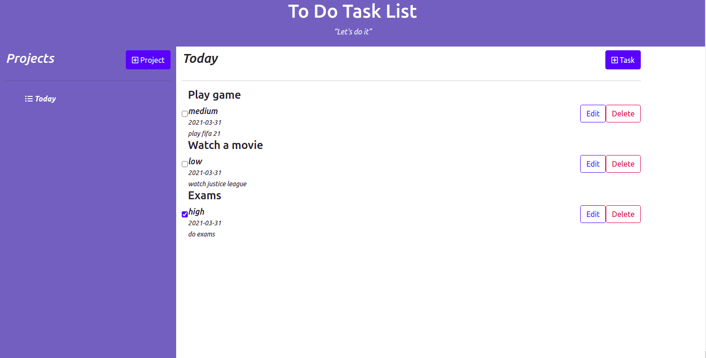

# To-Do
A web app that allows one to to create a to do list organized in form of projects.
- A to do can be marked as completed using a check box
- To do belongs to a certain project
- User can view the list of todos he has in a project and a list of projects he has.


## Built with;
- HTML 
- CSS
- Bootstrap
- JavaScript
- Webpack
- Linters

## Screenshot

## Live demo 

[See Live](http://pascalbyabasaija.me/To-Do/dist/index.html)

## Getting started

Clone or fork the source code into your local machine
```
git clone https://github.com/Byabasaija/To-Do.git
```
```cd``` into the cloned directory using
```
cd directory-name/
```

Open the directory in your favorite code editor e.g if your using Vs code
```
code .
```

Run ``` npm install ``` to install dependences

Navigate to  ``` dist/index.html ``` to run the project, or in your terminal run ``` npm start ``` and click on dist when your browser opens.


## Author
**Pascal Byabasaija**
- Linkedin: [Pascal Byabasaija](https://www.linkedin.com/in/pascal-byabasaija/)
- Github: [@Byabasaija](https://github.com/Byabasaija)

## 🤝 Contributions

Contributions, issues and feature requests are welcome!

Feel free to check the [issues page](issues/).


## Show your support

Give a ⭐️ if you like this project!

## Licence
MIT